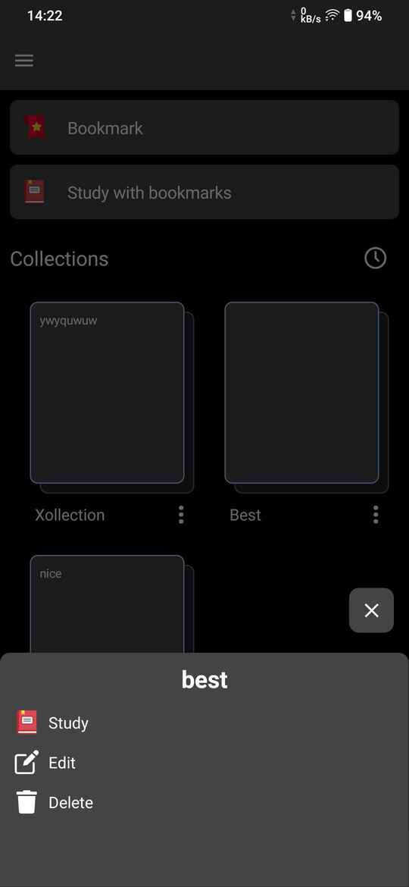
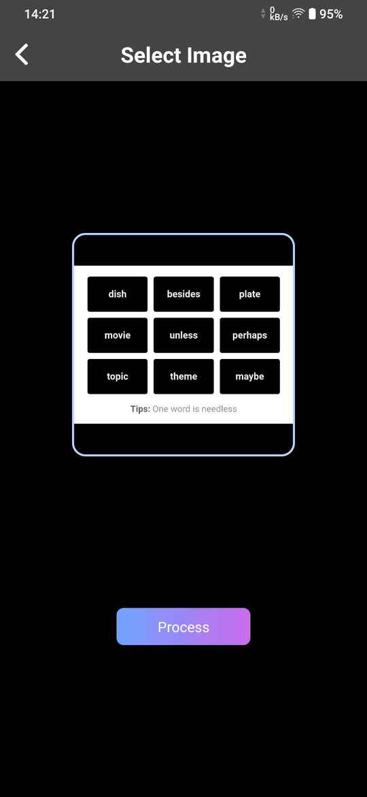
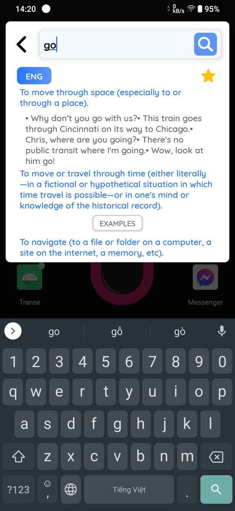
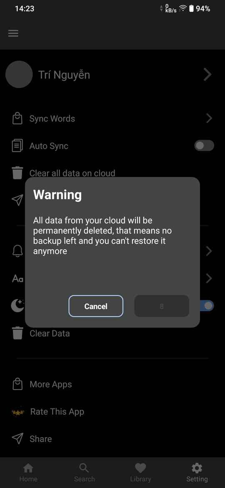

# English-Dictionary

## Note

- This page is created to demonstrate my app flow
- you can find the previous version via this link: https://github.com/TorryDo/Transe-v1-pub-deprecated

## Demo

https://drive.google.com/file/d/146e0wI_e4PjQWwEuVsMnCou69KGZihAM/view?usp=sharing

## About this app

### 1, Tech stack

- Kotlin language
- Jetpack Compose UI with custom state management
- Multi-Module architecture
- MVVI pattern with clean architecture
- Kotlin Coroutine Flows
- Ktor, Room Persistence, Kotlin Serialization, Moshi
- Firebase, Firestore, FCM, Authentication, …
- Koin DI

### 2, Features

- Look up English word definitions
- Create Flash-cards, save word collection to cloud
- Extract words from input image
- Look up English word definitions directly from other apps via Floating Bubble
- Remind recently searched words
- Show saved words in flashcard carousel

### 3, Screenshots

|                                    |                                    |                                    |
| :--------------------------------: | :--------------------------------: | :--------------------------------: |
|         |         |         |
|         |         |        |
|        |        |      |
|      |      |      |
|      |          |          |
|          |          |          |
|       |       |       |
|    |    |      |
|      |      |      |
|      |      |      |

